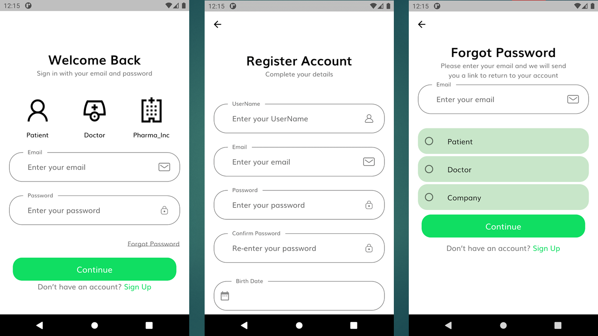
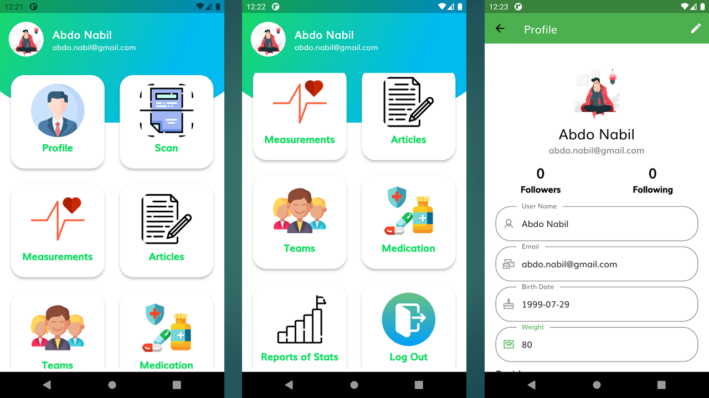
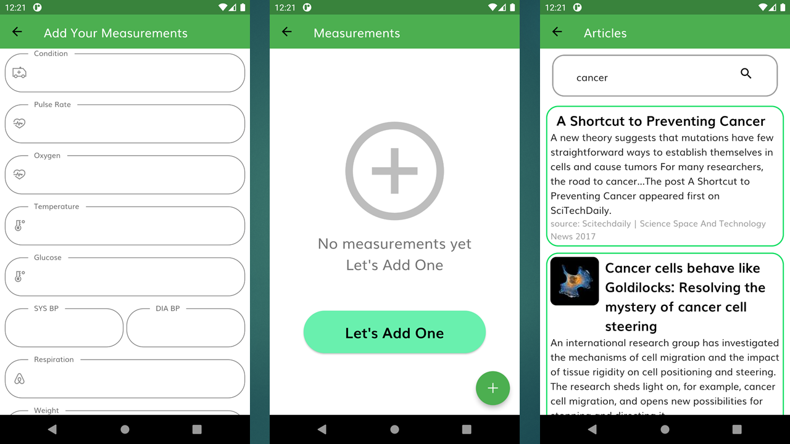
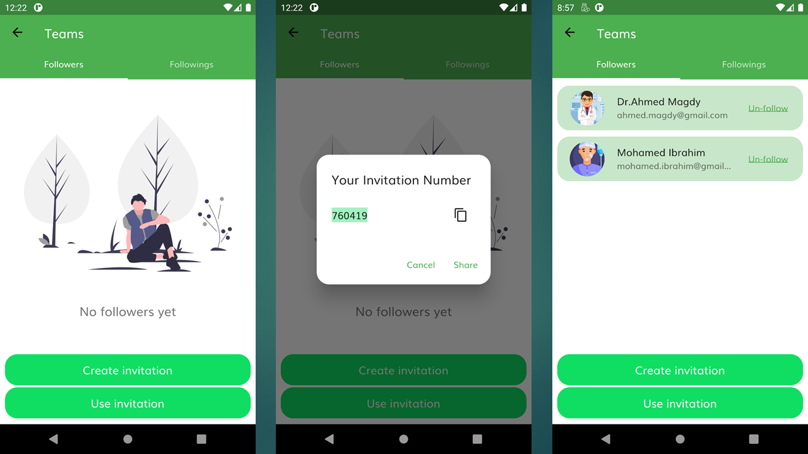
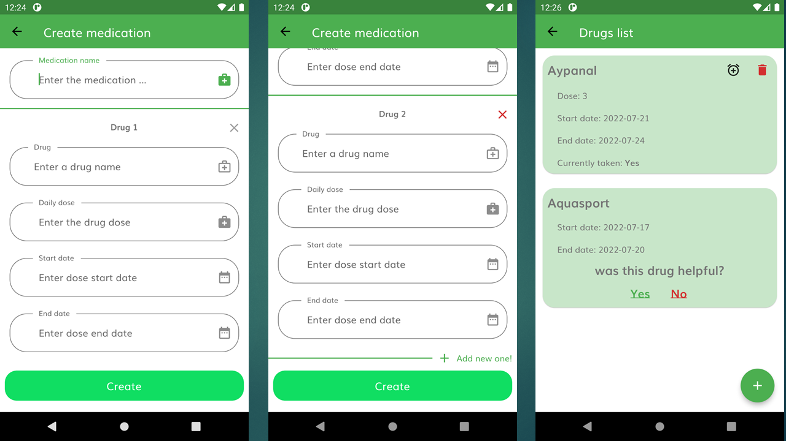
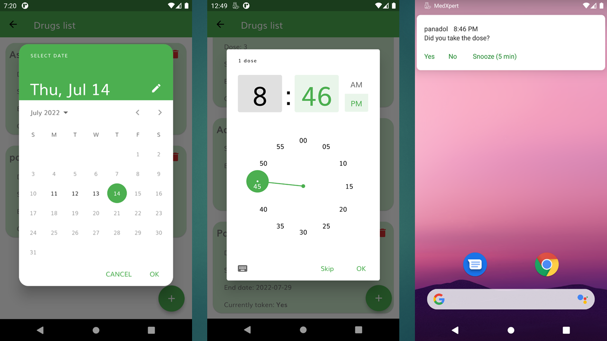

<!-- vertical space &nbsp; -->

#  MedXpert - MEDICAL MOBILE APPLICATION

## MedXpert is a multi-functional medical mobile application that takes the advantages of AI and Data analysis.

## ⚡&ensp;Key features

*  It helps the patients to organize their
medication intake and remind them of their medication time.

* Read doctors handwritten prescriptions.

* It provides medical articles that can help patients and doctors to know more about their medical conditions.

* It provides doctors with follow-up of patients, follow
their vital signs.

* More and more..............

---

## ✌&ensp;Preview

&ensp;

